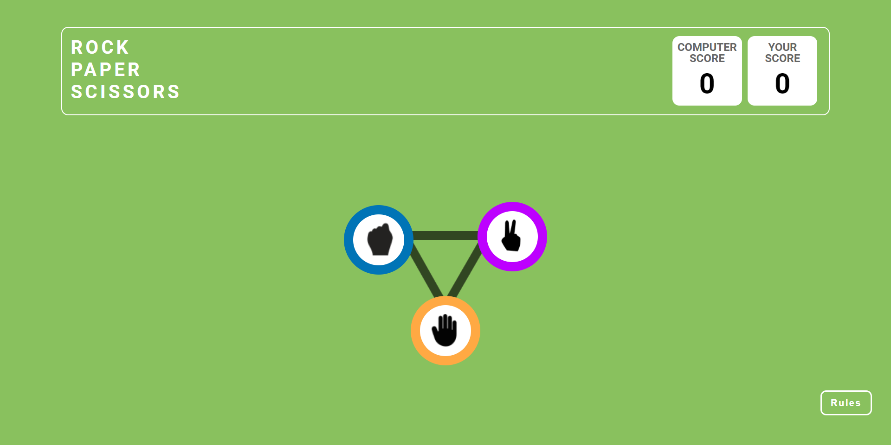
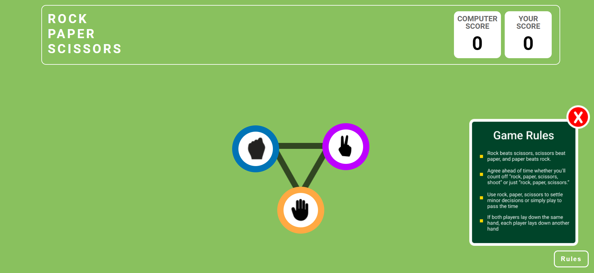

#Rock Paper Scissors Game
This is a simple Rock Paper Scissors game built using HTML, CSS, and JavaScript. The game allows the user to play against the computer. Each round, the user selects rock, paper, or scissors, and the computer randomly picks one as well. The game then determines the winner, highlights the results, and allows the player to play again.

#Features

- User can select rock, paper, or scissors.
- The computer randomly selects one option from rock, paper, or scissors.
- The game visually displays the player's choice and the computer's choice.
- Winner and loser are displayed with animated effects.
- The player can click Play Again to restart the game.
- Responsive design: The game layout adjusts to different screen sizes.

#Technologies Used

- HTML: For creating the structure of the game.
- CSS: For styling the game, adding animations for the winner and loser, and providing responsiveness.
- JavaScript (DOM Manipulation): For game logic, handling user input, computer’s random selection, and displaying results dynamically.

#Screenshots

Game Start Screen

Rules

Animation Effects on Player Win/Loss

Animation Effects on PC Win

Nxt Button Appear When Our score is higher than PC Score

Hurray Page

